# 📚 Tugas Pertemuan 9

---

## 📌 TUGAS 1

### Tabel Anggota
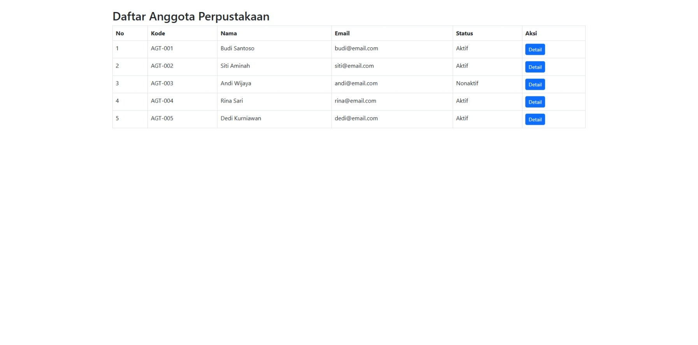

---

## 📌 TUGAS 2

### Halaman Index
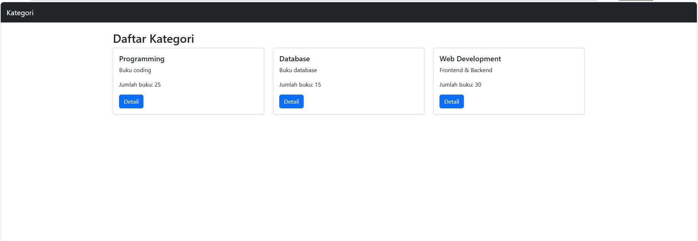

---

### Halaman Detail
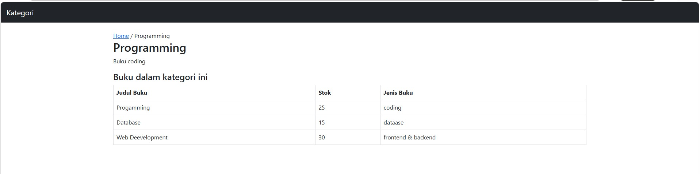

---

### Halaman Search
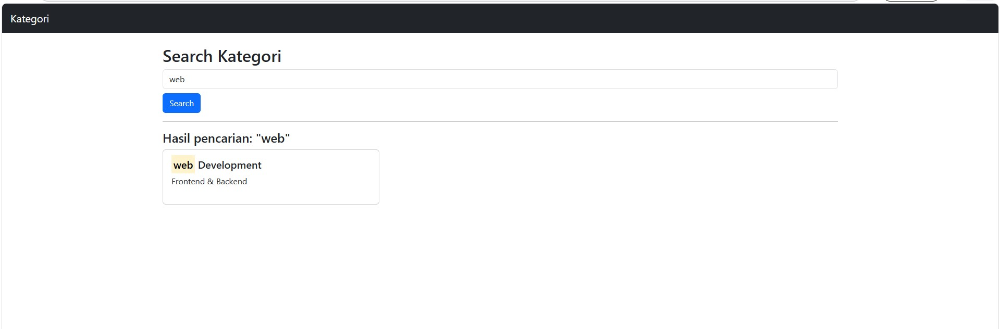

## 📚 TUGAS PERTEMUAN 10

## 📌 Migration
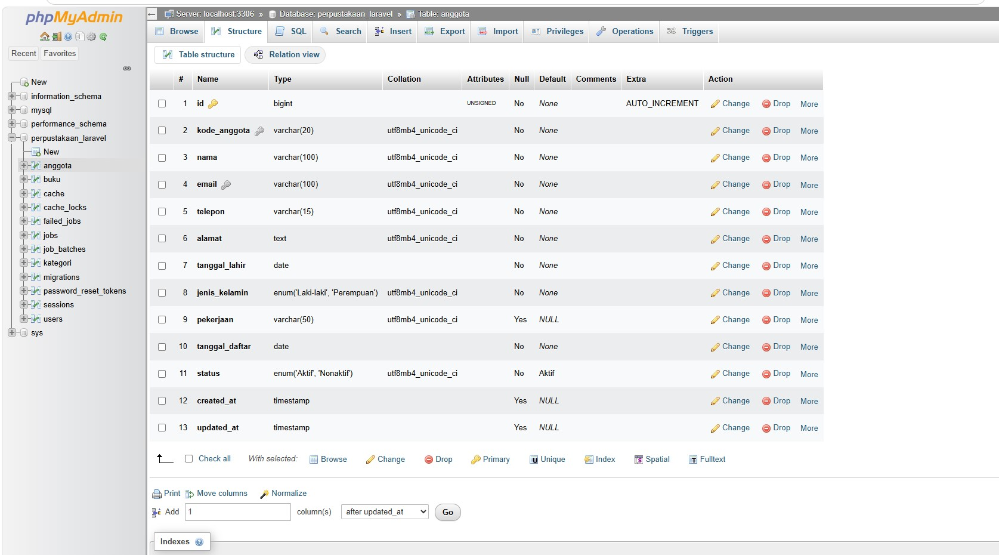
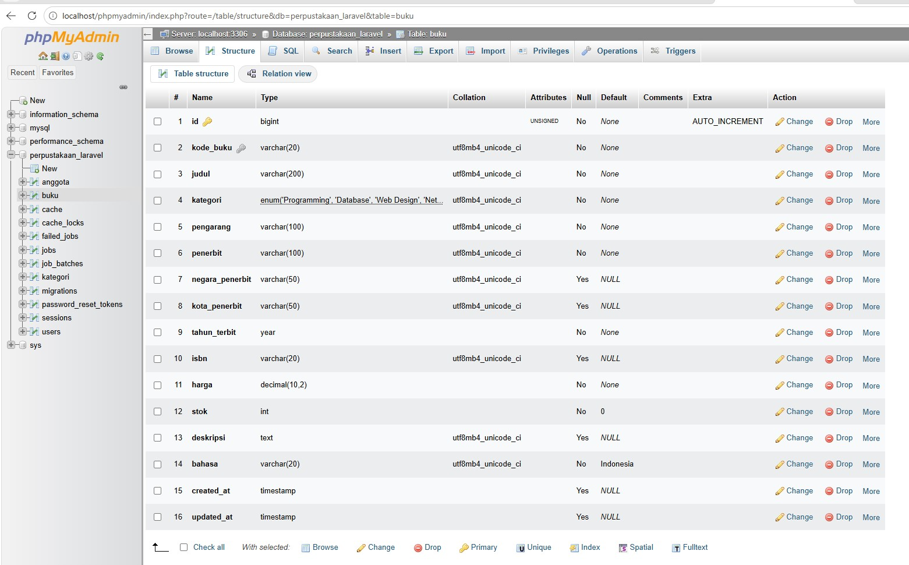

---

## 📌 Seeder

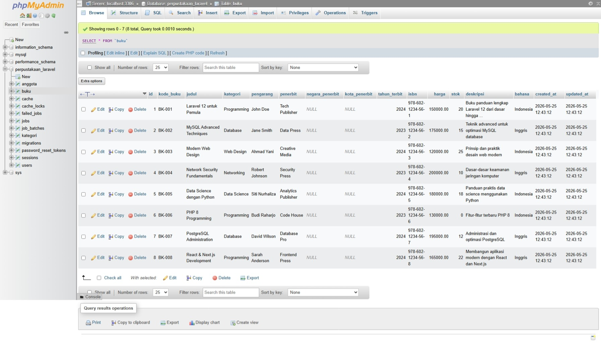
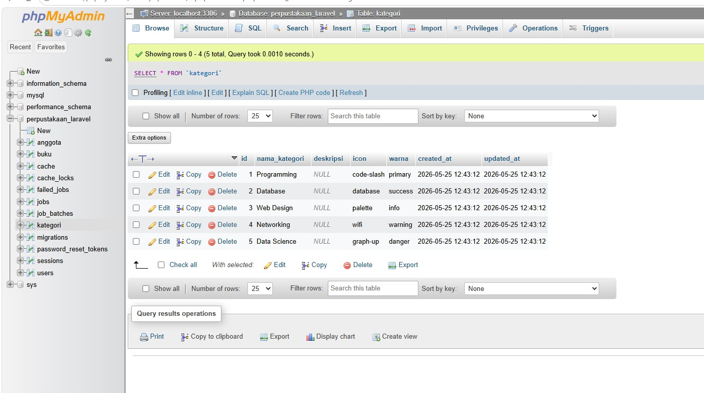

---

## 📌 Testing Route

### Halaman Buku
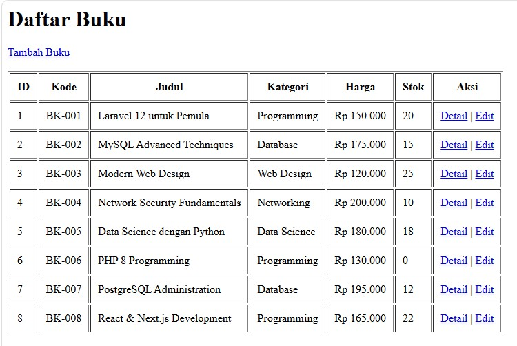

### Halaman Anggota
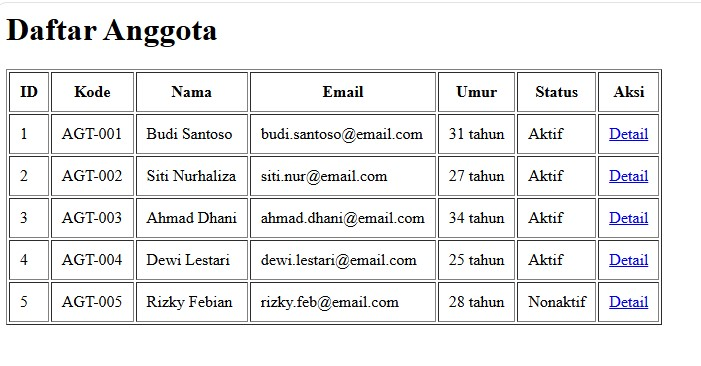

### Test Query
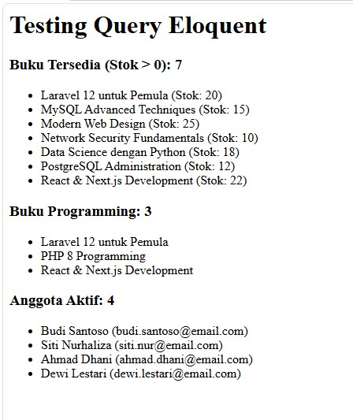

### Test Accessor & Scope
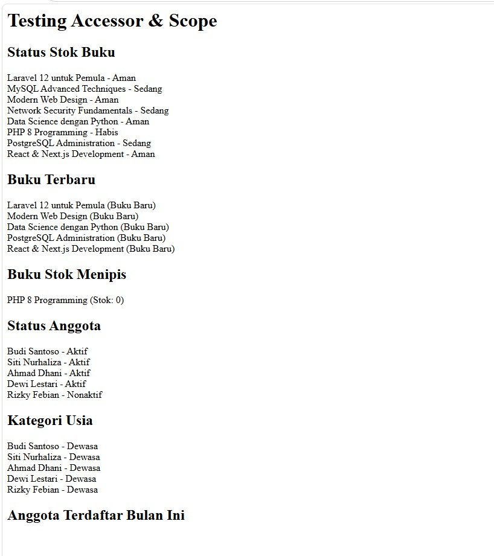

# 📚 Tugas Pertemuan 11

---

## 📌 TUGAS 1

### Halaman Dashboard
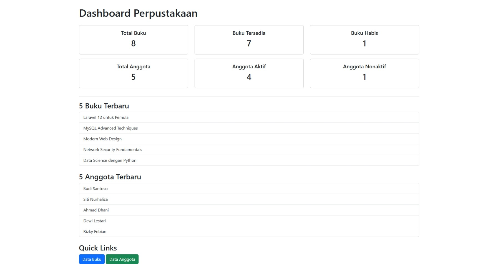

---

## 📌 TUGAS 2

### Blade Component
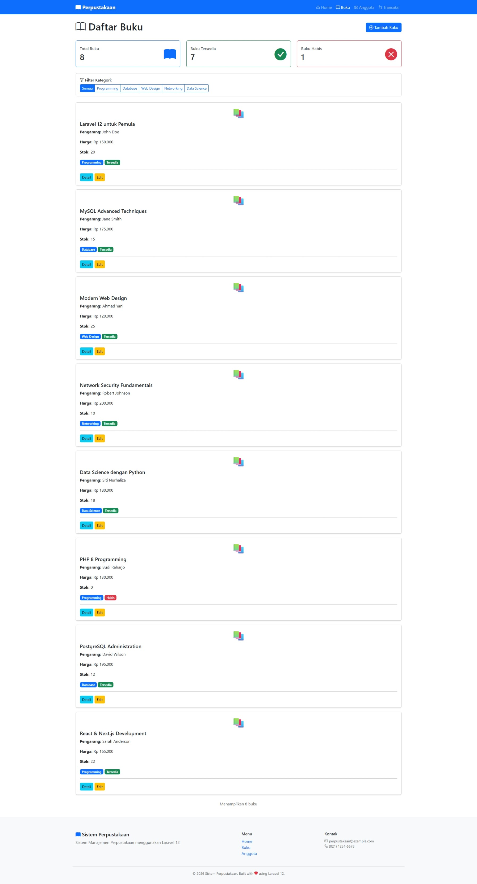

---
## 📌 TUGAS 3

### Search & filter buku
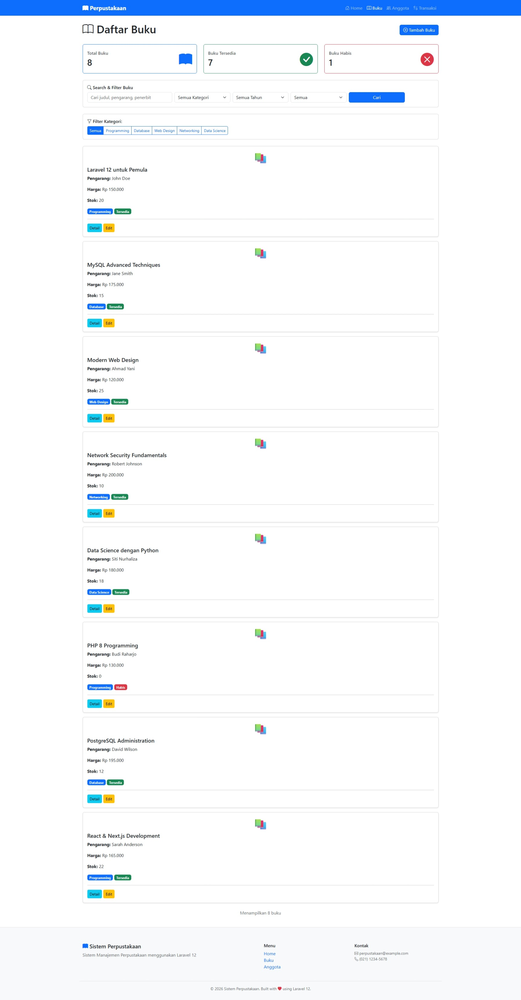